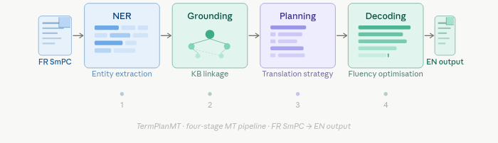
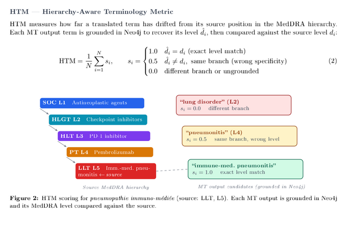

# TermPlan-MT  
**Terminology-aware machine translation** — French → English for SmPC **§4.8**, with **MedDRA-grounded** terminology kept consistent across several MT setups.

  
  
  
  
  

  
  
  
  
  

---

## Architecture

High-level path: **NER → grounding → planning → translation (S1–S5) → metrics.**

---

## HTM metric

**Hierarchy-aware terminology metric** — checks English hypotheses against MedDRA using the same hierarchy logic as upstream grounding (audit spans come from French `terms[]` on the segment JSONL).

---

## What this repo does

1. **NER** on French segments (`terms[]` in JSONL).  
2. **Grounding** — map spans to MedDRA in **Neo4j** (`pipeline/graph.py`, `TermGraph`).  
3. **Planning** — global per-surface locks shared across segments (`pipeline/planning.py`).  
4. **Translation** — multiple systems in **`pipeline/systems/`** (S1–S5); orchestrated by **`tools/pipeline/run_pipeline.py`**.  
5. **Evaluation** — fluency (**BLEU**, **chrF++**, optional **COMET**); terminology (**HTM**, hyp–ref agreement, **rHTM**); grounding coverage (**CCR**). Document-style BLEU variants live in **`scores_summary.csv`** (see `tools/eval/evaluate.py`).

---

## Quick start

| Step | What to do |
|------|------------|
| 1 | `cd` into the repo. If the folder name ends with a **space**, quote the path, e.g. `cd "/…/MT_Project_Terminology "`. |
| 2 | `python -m venv .venv` → `.venv/bin/pip install -r requirements.txt` |
| 3 | `docker compose up -d` — Neo4j for grounding / metrics. |
| 4 | Segment JSONL under **`data/section48/`** (`segments_ner*.jsonl`). Refresh NER with **`extras/experiments/french_medical_ner/biomistral_prompt_ner.py`** (see **`extras/README.md`**). |
| 5 | **Full matrix:** `./rerun_all.sh` (see script header for `SKIP_*`). **Ad hoc:** `PYTHONPATH=. python tools/pipeline/run_pipeline.py --segments … --results-dir …` |
| 6 | **Scores / figures:** `tools/eval/evaluate.py`, `tools/eval/plot_figures.py`, or the eval phase inside `rerun_all.sh` / `tools/eval/run_eval_plot_matrix.py`. |

**S1 / S2 reuse:** In `rerun_all.sh`, `REUSE_S1_S2_FROM_BIOLLM=1` (default) copies `results/ner_biollm/s1.jsonl` and `s2.jsonl` into other result trees and runs **S3–S5** only. Set to `0` for a full S1–S5 rerun per condition.

**Results folders:** **`results/ner_biollm/`** — prompted BioMistral NER on `segments_ner_biollm.jsonl`. **`results/ner_biollm_finetuned/`** — Unsloth NER segments (see `rerun_all.sh`). Git keeps **figures** (PNG, CSV, markdown); **`s*.jsonl`** are local / gitignored — regenerate with the pipeline + eval.

---

## Read more

| File | Topic |
|------|--------|
| `tools/README.md` | CLI layout (`run_pipeline`, `eval`, `data` tools) |
| `data/README.md` | Data tree, MedDRA, ontology JSONL |
| `extras/README.md` | NER prompt / Unsloth / ontology SFT |
| `docs/mistral_instruct_Ontology-Fine-tuning.md` | Mistral-7B-Instruct ontology fine-tuning |

**MedDRA** is not redistributed; obtain a licence, extract with `tools/data/extract_meddra.py`, load with `tools/data/build_graph.py` (details in `data/README.md`).
