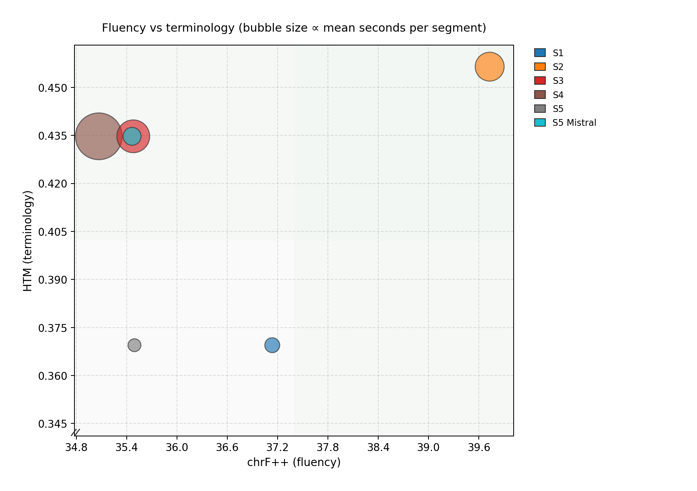

# Interpretation of results

**HTM (hierarchy-aware term match).** **`scripts/evaluate.py`** scores **HTM** when you pass **`--gold-terms`** with a FR→EN JSON list (French substring in source, English phrases checked in the hypothesis) together with **Neo4j** hierarchy consistency.

CSV summaries and PNG exports live under `results/`. Open this file from the **project root** if image links break in the preview. **Snapshot write-ups** (NER BioLLM, frozen figures): [interpretation_of_results_snapshots.md](interpretation_of_results_snapshots.md).

The results show that the main effect of TermPlanMT is not a general improvement in translation quality, but a shift in how translation decisions are made. S2, the long-context Mistral baseline, gives the strongest surface-form alignment to the English reference because it is optimising for fluent document-level translation without being forced to respect ontology structure. That makes it the best system for chrF/BLEU, but not for terminology control.

The graph-based systems behave differently. They only improve terminology when the source term is actually grounded with enough confidence for the graph to matter. Where **NER recall and CCR are high** (prompted BioMistral on this corpus), the graph provides a clearer signal: HTM reflects access to MedDRA-linked candidates and hierarchy. Where the extractor is **sparser** (fine-tuned BioMistral here: lower dataset CCR), the same six MT stacks behave more like a **fluency-first** regime on BLEU/chrF for S3–S5 because fewer terms reach planning. The NER stage sets the ceiling for downstream graph use.

At the same time, the results make the trade-off very clear. As ontology control increases, fluency metrics usually fall. This is not a failure of the graph; it is the expected effect of enforcing terminology in a domain where the reference translation is not always the most specific ontology-consistent option. The system is being pulled away from unconstrained paraphrase and toward terminology preservation. For regulatory medical text, that is often the correct direction, even if chrF and BLEU decrease.

The grounding coverage numbers explain most of the behaviour. Baseline NER is too sparse to support meaningful graph planning. **Prompted BioMistral** yields the **highest** dataset CCR on Section 4.8 in this repository snapshot; **fine-tuned BioMistral** yields **fewer** grounded spans on the same text. That density gap is visible in the cross-NER CCR figure and in the side-by-side tables in [`interpretation_of_results_snapshots.md`](interpretation_of_results_snapshots.md). If a term is not extracted and grounded, neither planning nor constrained decoding can recover it.

| NER pipeline (`rerun_all.sh`, string grounding) | Dataset CCR (committed snapshot) |
|--------------|------------|
| BioMistral prompt (`ner_biollm`) | ~35.4% |
| FT BioMistral (`ner_biollm_finetuned`) | ~32.4% |

CamemBERT baseline / FT CamemBERT are no longer in the primary reproduce script; regenerate those segment files from `experiments/french_medical_ner/` if you need historical comparison.

Reranking improves control only marginally relative to its cost. S4 is the clearest example of this: it is slower, but it does not consistently recover enough fluency or terminology to justify the added complexity. The same point applies to decoding-level constraints. Harder enforcement is only useful once the graph input is good enough. Otherwise, it simply constrains the model around a weak or incomplete term set.

The vector-based HTM results reinforce the same interpretation. Vector matching is stricter than string matching, so the scores are lower. That does not mean translation quality is worse; it means the evaluation is demanding a more precise semantic landing in the MedDRA hierarchy. In practice, it is a better test of whether the translated term is really placed in the right ontology region rather than merely sharing surface form with a known label.

HTM threshold overview and per-metric panels are stored under **`results/htm_vector_comparison/`** (PNG/PDF/CSV). Regenerate with `./rerun_all.sh` (set **`GOLD_TERMS_JSON`**, unless `SKIP_HTM_THRESHOLD_COMPARE=1`) or `PYTHONPATH=. python scripts/compare_htm_vector_thresholds.py --gold-terms …` (requires Neo4j + sentence-transformers).

**Segment exclusion.** Segment **`48_028`** is the Section 4.8 **Tableau 2** block (dense tabular adverse-reaction text). It is **excluded by default** in `rerun_all.sh` and in matching `evaluate.py` / `plot_results.py` calls (`--exclude-segment-ids 48_028`), so corpus metrics are **not** driven by that single atypical segment. Set `EXCLUDE_SEGMENT_IDS=` to empty if you need the full segment list.

**Overall.** Long-context MT is useful for fluent document-level translation, but it does not solve terminology consistency on its own. Ontology grounding improves hierarchy-aware translation, but only when NER recall and grounding coverage are high enough for the graph to be informative. The decisive factor is therefore not just whether graph structure is present, but whether the pipeline can reliably activate it on the source terms that matter.

---

Per-condition copies of the trade-off and bubble figures exist under each `results/ner_*/figures/` tree with the same filenames (`comparison_tradeoff_chrF_vs_HTM.png`, `comparison_bubble_chrF_HTM_time.png`, …).
