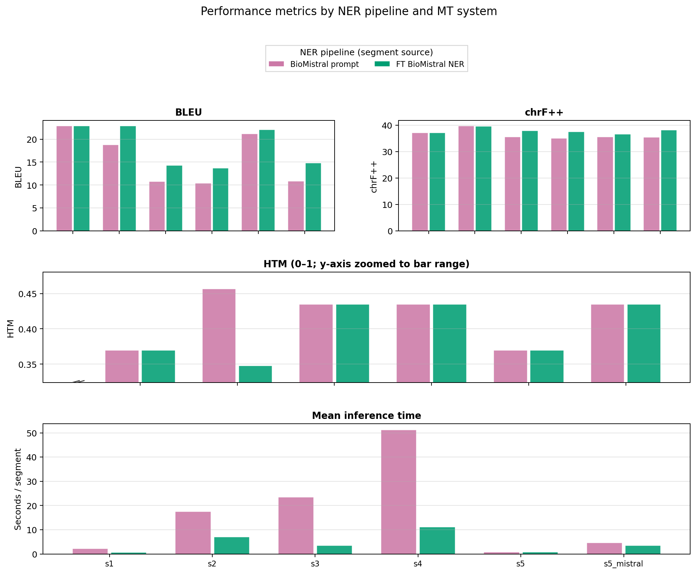
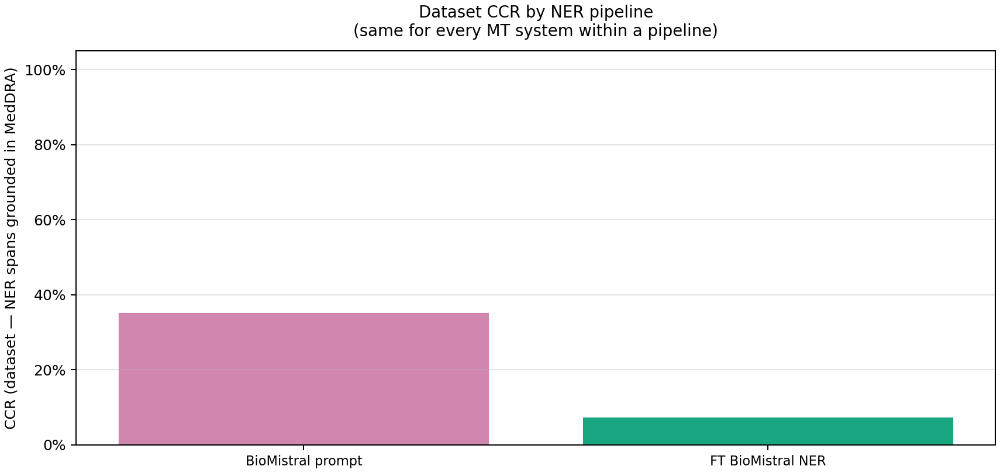
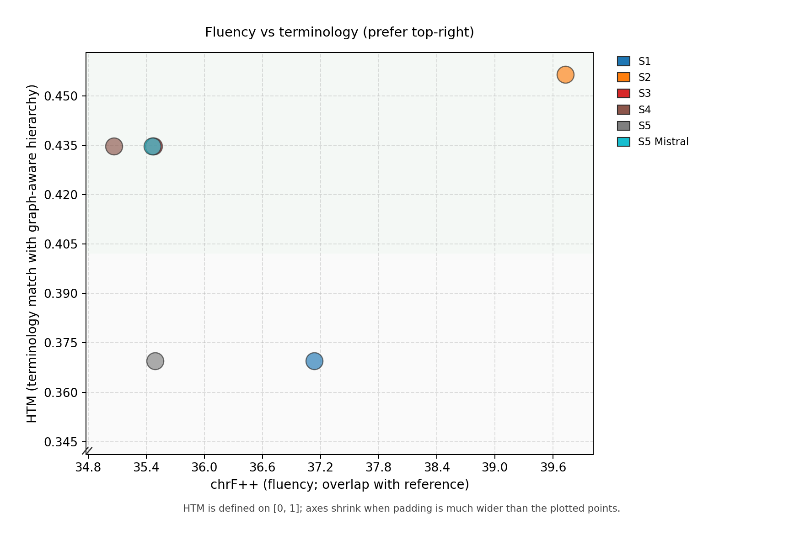
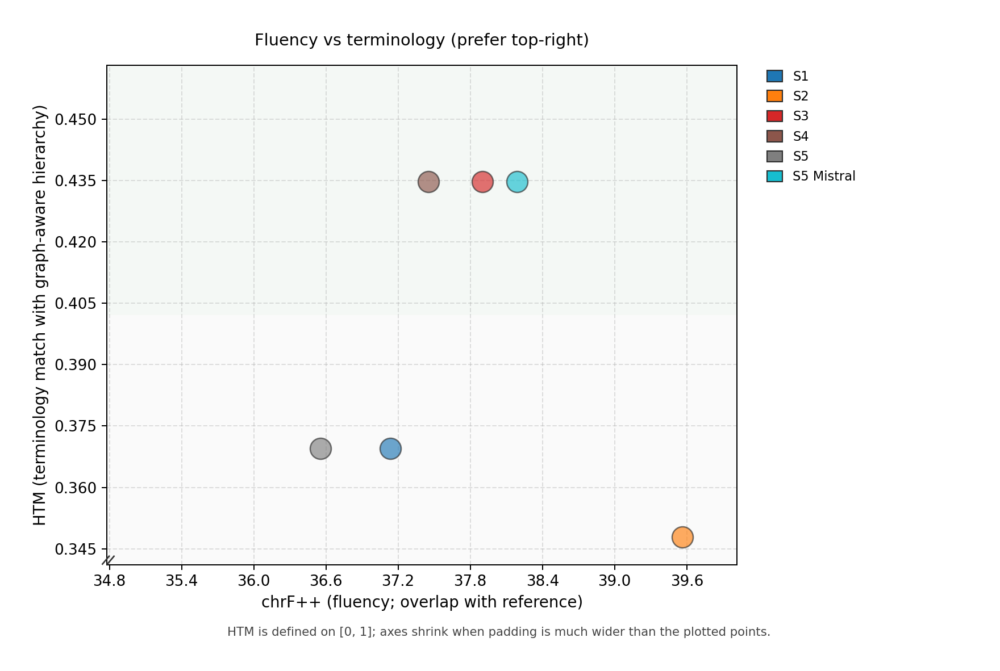

# Interpretation of results — BioMistral (prompt) vs fine-tuned BioMistral

This page compares the **two primary NER conditions** on the main reproduce path: **prompted BioMistral-7B** JSON-list extraction versus **fine-tuned BioMistral** (Unsloth LoRA) extraction. Everything else in the MT stack is the same (**S1–S5**; S5 can write NLLB and/or Mistral outputs); only the **segment JSONL** (`terms[]`) and therefore **CCR** and graph-sensitive behaviour change.

**Sources of truth for numbers in the tables:**  
[`results/ner_biollm/figures/scores_summary.csv`](../results/ner_biollm/figures/scores_summary.csv) and  
[`results/ner_biollm_finetuned/figures/scores_summary.csv`](../results/ner_biollm_finetuned/figures/scores_summary.csv)  
Tables and figures use the committed CSVs; segment **`48_028`** is excluded (`rerun_all.sh` default).

---

## 1. What is being compared?

| | **BioMistral (prompt)** | **Fine-tuned BioMistral** |
|--|-------------------------|---------------------------|
| **Results folder** | `results/ner_biollm/` | `results/ner_biollm_finetuned/` |
| **Segment JSONL** | `data/section48/segments_ner_biollm.jsonl` | `data/section48/segments_ner_unsloth_full.jsonl` (`rerun_all.sh` prefers `segments_ner_unsloth.jsonl` when that file exists) |
| **Extractor** | BioMistral-7B with a **JSON-list prompt** (`experiments/french_medical_ner/biomistral_prompt_ner.py`) | **LoRA fine-tuned** BioMistral NER (Unsloth merge export) |
| **Role in the thesis** | Strong **recall** of French spans → higher **CCR** on this slice | **Fewer** extracted spans on the same Section 4.8 text → **lower CCR**; graph stages see a sparser term set |

**Important.** **`ccr_dataset` is not comparable as a “higher is better” score across columns** on its own: it is “fraction of **that** JSONL’s NER spans that grounded in MedDRA”. More spans (prompt) vs fewer spans (FT) changes the denominator. Compare **systems within one column**, and use **CCR + downstream BLEU/chrF/HTM** together.

---

## 2. Dataset grounding (CCR) — one number per NER condition

| NER condition | `ccr_dataset` (string grounding, from CSV) | Interpretation |
|---------------|--------------------------------------------|----------------|
| BioMistral (prompt) | **0.354** | More FR surfaces in `terms[]` are mapped to MedDRA on this segment set |
| Fine-tuned BioMistral | **0.324** | Fewer extracted spans than prompt BioMistral on this slice (`segments_ner_unsloth_full.jsonl`) |

(See also the historical string vs vector CCR table in [`appendix_historical_ner_and_pipeline_results.md`](appendix_historical_ner_and_pipeline_results.md#5-ner-span-grounding-ccr--string-vs-vector-index-historical-snapshot).)

---

## 3. Six systems — side-by-side (same layout, two NER backends)

BLEU and chrF++ are **corpus** scores against the **same English reference** within each NER condition. **`scores_summary.csv`** was regenerated with `scripts/plot_results.py` (string Neo4j grounding, segment **`48_028` excluded**). **HTM** uses substring gating on gold rows from the **`--gold-terms`** JSON used at plot time.

### 3.1 Fluency and terminology (rounded from current `scores_summary.csv`)

| System | Metric | BioMistral **(prompt)** | FT BioMistral | Δ (FT − prompt) |
|--------|--------|-------------------------|---------------|-----------------|
| S1 NLLB | BLEU | 22.89 | 22.89 | 0.00 |
| S1 NLLB | chrF | 37.14 | 37.14 | 0.00 |
| S1 NLLB | HTM | 0.370 | 0.370 | 0.000 |
| S2 Mistral (doc) | BLEU | 18.81 | 22.91 | +4.10 |
| S2 Mistral (doc) | chrF | 39.73 | 39.56 | −0.17 |
| S2 Mistral (doc) | HTM | 0.457 | 0.348 | −0.109 |
| S3 GraphRAG | BLEU | 10.78 | 14.29 | +3.51 |
| S3 GraphRAG | chrF | 35.48 | 37.90 | +2.42 |
| S3 GraphRAG | HTM | 0.435 | 0.435 | 0.000 |
| S4 rerank | BLEU | 10.43 | 13.72 | +3.29 |
| S4 rerank | chrF | 35.07 | 37.45 | +2.38 |
| S4 rerank | HTM | 0.435 | 0.435 | 0.000 |
| S5 NLLB + boost | BLEU | 21.14 | 22.03 | +0.89 |
| S5 NLLB + boost | chrF | 35.49 | 36.55 | +1.06 |
| S5 NLLB + boost | HTM | 0.370 | 0.370 | 0.000 |
| S5 Mistral + boost | BLEU | 10.81 | 14.81 | +4.00 |
| S5 Mistral + boost | chrF | 35.46 | 38.19 | +2.73 |
| S5 Mistral + boost | HTM | 0.435 | 0.435 | 0.000 |

**Reading the table.** **S1** matches across folders when the same `s1.jsonl` is reused. Other systems were re-run per NER segment file, so **hypotheses differ** where the pipeline consumes `terms[]` (notably **S2** document context and **S3–S5** graph-aware stages). **HTM** depends on which gold rows fire from your **`--gold-terms`** list.

### 3.2 Latency (mean seconds per segment)

| System | BioMistral (prompt) | FT BioMistral |
|--------|----------------------|---------------|
| S1 | 2.13 | 0.67 |
| S2 | 17.48 | 6.96 |
| S3 | 23.48 | 3.45 |
| S4 | 51.20 | 11.08 |
| S5 | 0.72 | 0.75 |
| S5 Mistral | 4.62 | 3.41 |

S4 remains the slowest system under prompt NER on this machine snapshot; FT NER lowers several means (machine-specific).

---

## 4. Figures (cross-condition)

**Cross-NER dashboard** (several NER pipelines × six systems):

**Per-condition trade-off** (example: prompted BioMistral NER):

**Per-condition trade-off** (fine-tuned BioMistral NER):

---

## 5. Short interpretation (accurate, conservative)

1. **Grounding density:** Prompted BioMistral yields **more** extracted spans and a **higher CCR** on this slice than FT BioMistral; the graph therefore receives a **richer** term set for planning-heavy systems.
2. **Fluency vs reference:** **S3–S5** show **higher BLEU/chrF** under FT NER in this snapshot—consistent with fewer graph injections pulling hypotheses away from the reference, **not** automatically with “better MedDRA adherence” on HTM (gold-triggered HTM can stay flat).
3. **Reporting:** **HTM** uses the **`--gold-terms`** JSON for substring gating (see `docs/RESULTS_INTERPRETATION.md`).

---

## 6. Where to read next

| Document | Purpose |
|----------|---------|
| [`RESULTS_INTERPRETATION.md`](RESULTS_INTERPRETATION.md) | Longer narrative, trade-off figures, segment exclusion note |
| [`appendix_historical_ner_and_pipeline_results.md`](appendix_historical_ner_and_pipeline_results.md) | Full appendix: CamemBERT history, vector CCR snapshot, regeneration commands |
| [`results/ner_biollm_eval_snapshot_no_graph/INTERPRETATION_OF_RESULTS_MT.md`](../results/ner_biollm_eval_snapshot_no_graph/INTERPRETATION_OF_RESULTS_MT.md) | Frozen **prompt BioMistral** run without Neo4j (legacy tables + figures) |
