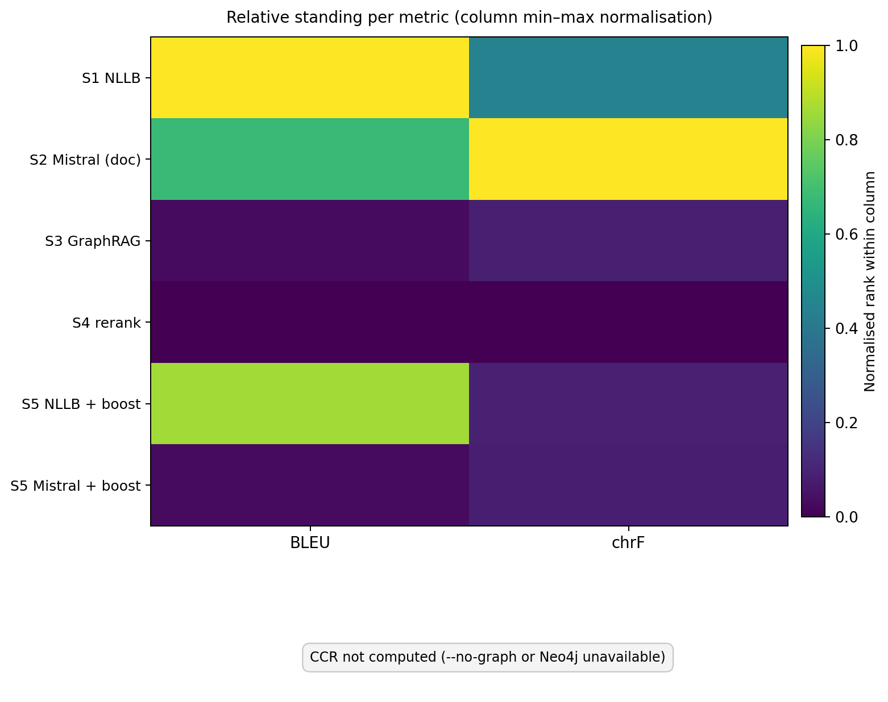
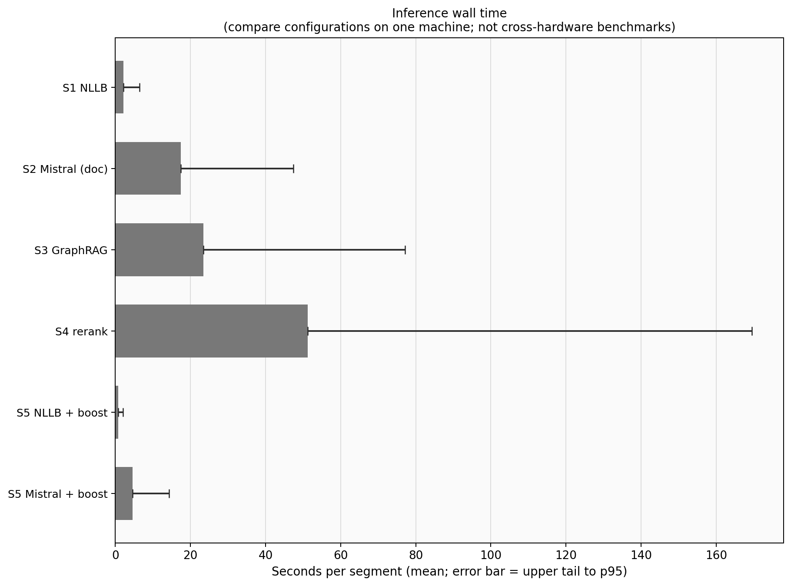

# Interpretation of results — NER BioLLM snapshot (no graph)

Frozen automatic metrics for the **NER BioLLM** segment set (`segments_ner_biollm.jsonl`), aligned with `results/ner_biollm` but **self-contained here** for reporting: figures, tables, console logs, and this note.

**Index:** [How this was produced](#how-this-snapshot-was-produced) · [Numbers](#summary-metrics) · [Discussion](#interpretation) · [Figures](#figures) · [Limits](#limitations)

---

## How this snapshot was produced

| Setting | Value |
|--------|--------|
| Segments | `data/section48/segments_ner_biollm.jsonl` |
| Excluded segment | `48_028` — dense Section 4.8 **Tableau 2** block; excluded by default on the main reproduce path so one table does not dominate corpus scores |
| Grounding | `--grounding-mode string` |
| Neo4j | **Off** (`--no-graph`) → **HTM** and **dataset CCR** are omitted; BLEU, chrF, and COMET (when requested) do not need the graph. |
| Logs | `evaluate_console.txt`, `plot_console.txt` |
| Outputs | `figures/` from `scripts/plot_results.py` with the same flags |

Reproduce:

```bash
./.venv/bin/python scripts/evaluate.py --no-graph --grounding-mode string \
  --results-dir results/ner_biollm \
  --segments data/section48/segments_ner_biollm.jsonl \
  --exclude-segment-ids 48_028

./.venv/bin/python scripts/plot_results.py --no-graph --comet \
  --results-dir results/ner_biollm \
  --out-dir results/ner_biollm_eval_snapshot_no_graph/figures \
  --segments data/section48/segments_ner_biollm.jsonl \
  --exclude-segment-ids 48_028
```

`--comet` fills COMET in `figures/scores_summary.csv` and grouped plots (slow; one subprocess per system).

---

## Summary metrics

| System | BLEU | chrF | COMET | HTM | CCR (dataset) |
|--------|------|------|-------|-----|---------------|
| s1 | 22.89 | 37.14 | 0.639 | — | — |
| s2 | 18.81 | 39.73 | 0.629 | — | — |
| s3 | 10.78 | 35.48 | 0.587 | — | — |
| s4 | 10.43 | 35.07 | 0.591 | — | — |
| s5 | 21.14 | 35.49 | 0.637 | — | — |
| s5_mistral | 10.81 | 35.46 | 0.586 | — | — |

**Wall time** (seconds per segment, mean and 95th percentile):

| System | mean s | p95 s |
|--------|--------|-------|
| s1 | 2.13 | 6.40 |
| s2 | 17.48 | 47.46 |
| s3 | 23.48 | 77.14 |
| s4 | 51.20 | 169.47 |
| s5 | 0.72 | 2.01 |
| s5_mistral | 4.62 | 14.27 |

Display names and CSV: `figures/scores_summary.csv`, `figures/paper_summary_table.md`.

---

## Interpretation

### Fluency (BLEU and chrF)

- **s2** (Mistral, document-level) has the **highest chrF** (39.73) with **lower BLEU** than **s1** (22.89 / 37.14) — often freer wording vs a single reference; validate with manual samples.
- **s5** (NLLB + boost) is **near s1** on BLEU with **slightly lower chrF** — boost trades a little n-gram overlap for comparable bulk overlap.
- **s3** / **s4** sit **lower** on both metrics (~10–11 BLEU, ~35 chrF); whether that is harmful depends on terminology and human preference, not these scores alone.
- **s5_mistral** sits in the **low-BLEU** band with chrF like other constrained runs.

### COMET

**Unbabel/wmt22-comet-da** corpus scores for **all six systems** (see table). `scripts/evaluate.py` and `scripts/plot_results.py --comet` each invoke COMET in a **short-lived subprocess per system** so CUDA / Lightning teardown does not zero out later rows (shared helper: `pipeline/metrics/comet_score.py`).

### Latency

**s5** is fastest on average; **s4** is slowest with a **heavy p95** tail. Cross-system totals are **indicative only** when some stacks differ on CPU vs GPU (see script banner in logs).

---

## Figures

Plots below are the same PNGs under `figures/`; each has a matching **`.pdf`** for print.

### Grouped metrics


### Heatmap (column-normalised)



### Inference time



With `--no-graph`, **chrF vs HTM** and **bubble (time)** charts are **omitted by design** (they need Neo4j HTM).

---

## Limitations

- Single reference → BLEU/chrF can mis-rank legitimate variation.
- **No HTM / CCR** here → no graph-level terminology score in this snapshot.

Raw logs: `evaluate_console.txt`.
